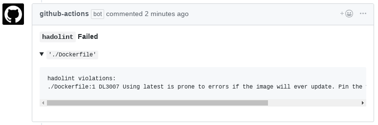

# Hadolint Action

DEPRECATED: Please use the official [hadolint github action](https://github.com/hadolint/hadolint-action)

<a href="https://github-actions.netlify.com/hadolint"></a> 

A GitHub action to run [hadolint](https://github.com/hadolint/hadolint) and reports violations given a Dockerfile within a repository on a pull request

## Usage

### V2 Workflows
```
on: pull_request
name: hadolint action
jobs:
  hadolintOnPr:
    name: hadolint on pr
    runs-on: ubuntu-latest
    steps:
    - uses: actions/checkout@master
    - name: hadolint on pr
      uses: burdzwastaken/hadolint-action@master
      env:
        GITHUB_TOKEN: ${{ secrets.GITHUB_TOKEN }}
        HADOLINT_ACTION_DOCKERFILE_FOLDER: .
```

### V1 Workflows
```
workflow "hadolint action" {
  on = "pull_request"
  resolves = ["hadolint on pr"]
}

action "hadolint on pr" {
  uses = "burdzwastaken/hadolint-action@master"
  secrets = ["GITHUB_TOKEN"]
  env = {
    HADOLINT_ACTION_DOCKERFILE_FOLDER = "."
  }
}
```

## Environment Variables

Name | Default | Description
--- | --- | ---
`HADOLINT_ACTION_DOCKERFILE_FOLDER` | `.` | Which directory the `Dockerfile` to run hadolint on resides in. Relative to the root of the repository.
`HADOLINT_ACTION_COMMENT` | `true` | Set to `false` to disable commenting back on the PR with the violations found in the `Dockerfile`.

## In Action



## FAQ
* How can I ignore rules as this action does not (yet) support supplying a
  configuration file?
  * You can utilize
	[inline-ignores](https://github.com/hadolint/hadolint#inline-ignores) within
	your `Dockerfile`

## TODO
* Let users supply their own `hadolint.yaml` and/or trusted registries passed through
* Multiple `Dockerfile` support
